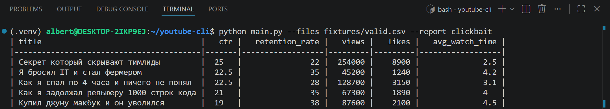
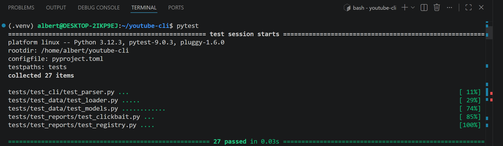

# YouTube Metrics CLI

CLI-утилита на Python для анализа YouTube-метрик из CSV. Подробности — в [SPEC.md](SPEC.md).

Демонстрация работы CLI:



Демонстрация работы CLI pytest:




## Установка

```bash
python -m venv .venv
source .venv/bin/activate
pip install -e ".[dev]"
```

## Запуск

```bash
python main.py --files fixtures/valid.csv --report clickbait
```

После установки пакета:

```bash
python -m youtube_cli --files fixtures/valid.csv --report clickbait
```
